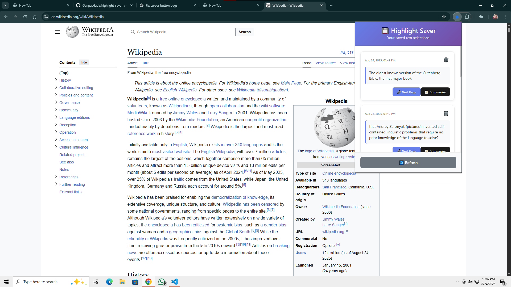

# ✨ Highlight Saver + Summarizer (Chrome Extension)

A powerful Chrome extension that lets you **highlight text on any website**, save it with one click, and even **generate AI-powered summaries** of your highlights — all inside a clean, modern popup UI.  


## 🎥 Demo Video  

[](https://share.zight.com/llulNdWJ)

## 🚀 Features

- 🖱️ **Text Selection** – Highlight any text on any website  
- 💾 **Quick Save Button** – Floating save button appears next to your selection  
- 🎨 **Beautiful Popup UI** – Responsive React-based interface  
- 📌 **Persistent Storage** – Highlights are stored locally and persist across sessions  
- 🔗 **Quick Access** – Open original source pages instantly  
- 🗑️ **Manage Easily** – Delete highlights you no longer need  
- 🤖 **AI Summarization** – Summarize saved highlights with Cohere AI  


## 🛠️ How It Works

1. **Select Text** – Highlight any text on a webpage.  
2. **Save** – Click the floating "💾 Save" button.  
3. **View** – Open the extension popup to see your highlights.  
4. **Summarize** – Click "✨ Summarize" to generate a short AI summary.  
5. **Manage** – Delete saved highlights or revisit their original pages.  


## Installation

### Development Setup

1. **Clone or download this repository**
   ```bash
   git clone https://github.com/GanpatHada/highlight_saver_chrome_extension.git
   cd highlight_saver_chrome_extension
   ```

2. **Install dependencies**
   ```bash
   npm install
   ```

### 🔑 Environment Setup  

Create a **`.env`** file in the root of your project and add your Cohere API key:  

```bash
VITE_COHERE_API_KEY=your_cohere_api_key_here
```


3. **Build the extension**
   ```bash
   npm run build-extension
   ```

4. **Load in Chrome**
   - Open Chrome and go to `chrome://extensions/`
   - Enable "Developer mode" (toggle in top right)
   - Click "Load unpacked"
   - Select the `dist` folder from this project

### Icons Setup

Before building, replace the placeholder icon files with actual PNG images:
- `public/icon16.png` (16x16 pixels)
- `public/icon48.png` (48x48 pixels) 
- `public/icon128.png` (128x128 pixels)

You can create these using any image editor or online icon generator.

## Development

### Available Scripts

- `npm run dev` - Start development server
- `npm run build-extension` - Build the extension for production
- `npm run lint` - Run ESLint
- `npm run preview` - Preview the built app

### Project Structure

```
highlight_saver_chrome_extension/
├── public/
│   ├── manifest.json          # Extension manifest
│   ├── content.js             # Content script for text selection
│   ├── content.css            # Styles for content script
│   ├── background.js          # Background script for storage
│   └── icon*.png              # Extension icons
├── src/
│   ├── App.jsx                # Main React component
│   ├── App.css                # Popup styles
│   └── main.jsx               # React entry point
├── scripts/
│   └── copy-extension-files.js # Build script
└── dist/                      # Built extension (after build)
```

### Key Components

- **Content Script** (`public/content.js`): Handles text selection detection and shows the save button
- **Background Script** (`public/background.js`): Manages storage and communication
- **React App** (`src/App.jsx`): Beautiful popup interface for viewing highlights
- **Manifest** (`public/manifest.json`): Extension configuration and permissions

## Usage

1. **Install the extension** following the installation steps above
2. **Navigate to any website** (e.g., news articles, blogs, documentation)
3. **Select text** by clicking and dragging over the text you want to save
4. **Click the save button** that appears next to your selection
5. **View your highlights** by clicking the extension icon in your browser toolbar
6. **Manage highlights** by deleting them or visiting the original pages

## Permissions

The extension requires the following permissions:
- `activeTab`: To access the current tab for text selection
- `storage`: To save highlights locally
- `scripting`: To inject content scripts
- `<all_urls>`: To work on any website

## Technical Details

- **Manifest Version**: 3 (latest Chrome extension standard)
- **Storage**: Uses Chrome's local storage API
- **UI Framework**: React with modern CSS
- **Build Tool**: Vite for fast development and building
- **Content Scripts**: Vanilla JavaScript for performance

## Troubleshooting

### Extension Not Working
- Make sure you've enabled "Developer mode" in Chrome extensions
- Check that the extension is loaded from the correct `dist` folder
- Refresh the webpage you're trying to use the extension on

### Save Button Not Appearing
- Ensure you've selected text (not just clicked)
- Try selecting text on a different part of the page
- Check the browser console for any errors

### Build Issues
- Make sure all dependencies are installed (`npm install`)
- Check that all required files exist in the `public` folder
- Ensure you have proper icon files (PNG format)

## Contributing

1. Fork the repository
2. Create a feature branch
3. Make your changes
4. Test thoroughly
5. Submit a pull request

## License

This project is open source and available under the MIT License.

## Support

If you encounter any issues or have questions, please open an issue on the repository.
